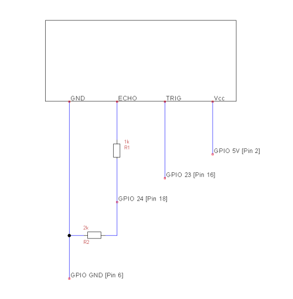
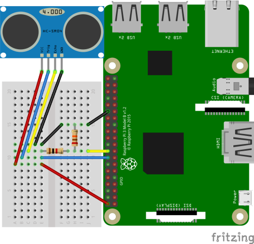

## What is the ultrasonic sensor?

>Ultrasonic ranging module HC - SR04 provides 2cm -
400cm non-contact
measurement function, the ranging accuracy can reac
h to 3mm. The modules
includes ultrasonic transmitters, receiver and cont
rol circuit.
> (Source: [http://www.micropik.com/PDF/HCSR04.pdf](http://www.micropik.com/PDF/HCSR04.pdf))

For the purpose of the course the sensor is used as a water gauge. It will be physically installed over the water measuring the relative distance down to the water. This documentation describes how to connect the ultrasonic sensor to the Raspberry PI and measure the distance.

#### Connecting to the Pi

##### Prerequisites

- Raspberry Pi 3 Model B
- Breadboard
- Ultrasonic sensor HC - SR04
- Wires: 8x
- Resistors: 1x 1k&Omega;, 1x 2k&Omega;

##### Connection

The HC - SR04 has four pins. The VCC pin is for the power supply and is connected to the 5V pin of the Pi. The GND pin is connected to the GND pin of the Pi. The other two pins are for triggering the signal and receiving the echo.
Please connect the HC - SR04 and the Pi as shown in the graphics below.

